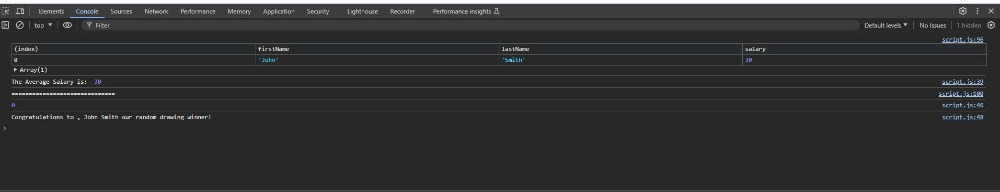
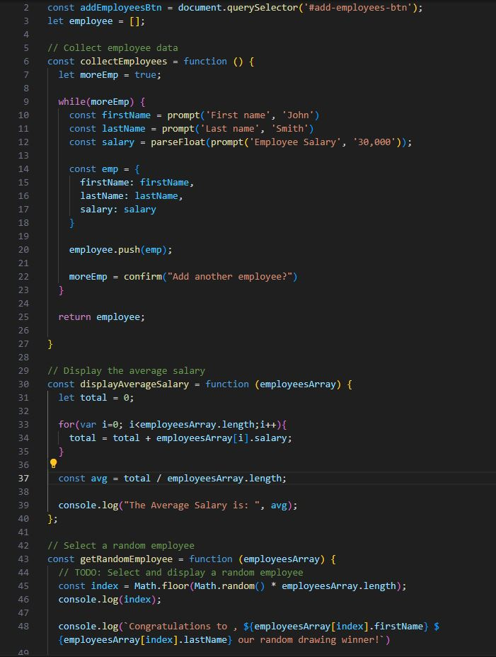

# employee-payroll

## Discription 

https://b3hold23.github.io/employee-payroll/

This Page will take the information from the user and display it in order by their Last name then their first name, followed by the salary they currently have. If you inspect the page you will be able to see the following information: 

This is where you will find the average salary of the employee, and the winner of the drawing. 

 
 

## Usage

Behing the scenes I am using JavaScript to complete this task. 

